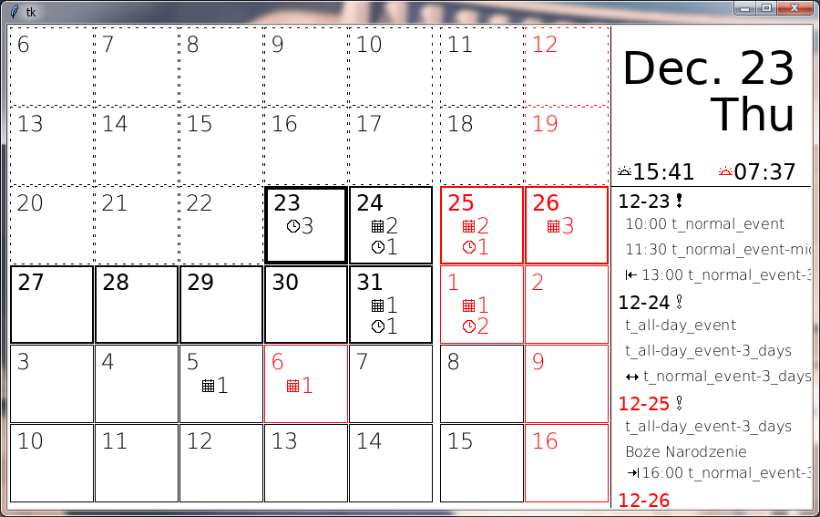

# WaveshareEInkCalendar
Application for drawing a calendar, that can be displayed on three-color E-Ink display. Tested on Waveshare's 7.5 inch black-red-white display: https://www.waveshare.com/7.5inch-hd-e-paper-hat-b.htm .

# Features
- Supports events from iCal files/servers,
- Supports events from CalDAV servers (tested on Radicale),
- Returns images expected by Waveshare's E-Ink drivers (tested on monochrome and tri-color displays),
- Next sunrise and sunset - if past sunrise, will display time of next one. Also displays if the time of sunrise/set goes up or down,
- Tasklist for next X days - also displays icons for today and next X days,\
- Tasklist also displays events spanning multiple days,
- Shows number of all-day and normal events on each day,
- Calendar shows X previous and Y future weeks,
- Calendar does **NOT** follow the strange logic of displaying only current month. We know, that time flows without breaks, and new month is not a reset of anything,
- Can be used to draw calendar for any day,
- Should be easy do personalize, either by modifying config or by extending the code,
- Draws holidays using red,
- Works on Raspberry Pi Zero,
- Draw test - displays calendar in window, for testing purposes.

# Setup
Check [configuration class](calendarframe/CalendarFrameDraw.py#L14) for available options. Set `config.size` to the size of your E-Ink display and define colors supported by it in `config.colors`. If you're only going to display calendar on E-Ink, then only number of colors is important, values can be anything.

# TODO list
- Per-event holiday marker - if event description contains some specific tag, whole day will be treated as holiday,
- Checking if there was any change in calendar - to avoid unnecessary redrawing,
